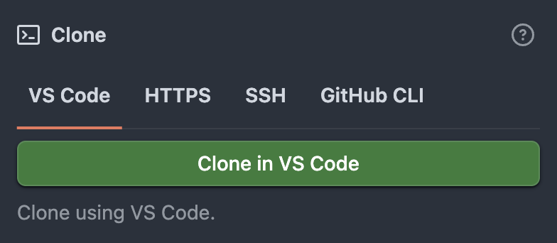
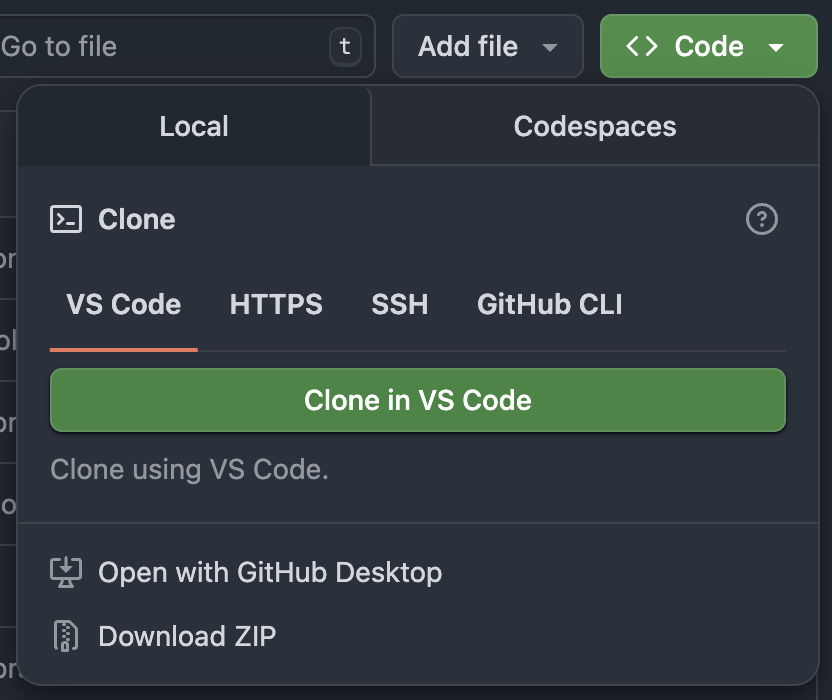

# GitHub Clone in VS Code 🚀

> Seamlessly adds a "Clone in VS Code" button to GitHub repositories as if it were a native feature for instant one-click cloning.



[](https://github.com/AdamAkhlaq/github-clone-in-vscode/stargazers)
[](https://www.typescriptlang.org/)
[](https://developer.chrome.com/docs/extensions/mv3/)
[](LICENSE)

---

## 🎯 What it does

This Chrome extension seamlessly integrates with GitHub's interface by adding a **"Clone in VS Code"** button directly to repository pages. With one click, it opens the repository in Visual Studio Code using the `vscode://` URL protocol, eliminating the need to manually copy URLs and run git commands.

### ✨ Key Features

- 🎯 **One-click cloning** - Instantly clone and open repositories in VS Code
- 🔗 **Native GitHub integration** - Blends perfectly with GitHub's existing UI
- ⚡ **Lightweight & Fast** - Minimal permissions, maximum performance
- 🚫 **No popup clutter** - Clean button injection without intrusive UI
- 🔄 **SPA support** - Works seamlessly with GitHub's single-page navigation
- 🎨 **Native styling** - Matches GitHub's design language perfectly
- 🛡️ **Privacy-focused** - Only accesses GitHub pages, no data collection

---

## 🚀 How it works

1. **Visit any GitHub repository** (e.g., [github.com/AdamAkhlaq/github-clone-in-vscode](https://github.com/AdamAkhlaq/github-clone-in-vscode))
2. **Click the green "Code" button** on the repository page

   

3. **See "Clone in VS Code" as the first option** in the dropdown menu
4. **Click it** and VS Code opens with the clone dialog ready!
5. **Start coding immediately** - No manual URL copying or terminal commands needed

The extension generates a `vscode://vscode.git/clone?url=https://github.com/owner/repo.git` URL that VS Code recognizes and handles automatically.

---

## 💻 Installation

### Chrome Web Store (Coming Soon)

1. Visit the [Chrome Web Store page](https://chrome.google.com/webstore/])
2. Click "Add to Chrome"
3. Navigate to any GitHub repository and start cloning!

### Manual Installation (For Developers)

1. Download the latest release from [GitHub Releases](https://github.com/AdamAkhlaq/github-clone-in-vscode/releases)
2. Extract the ZIP file
3. Open Chrome and navigate to `chrome://extensions/`
4. Enable "Developer mode" in the top right
5. Click "Load unpacked" and select the extracted folder

---

## 🛠️ Technical Details

- **Framework**: TypeScript with Chrome Manifest V3
- **Architecture**: Lightweight content script injection
- **Permissions**: Minimal - only `*://github.com/*` host permission
- **Compatibility**: All Chromium-based browsers (Chrome, Edge, Brave, etc.)
- **VS Code Support**: Works with VS Code, VS Code Insiders, and compatible editors

### Browser Compatibility

This extension works seamlessly across all Chromium-based browsers, providing the same consistent experience regardless of your browser choice. Firefox support is planned for a future release.

---

## 🔧 Development

### Prerequisites

- Node.js 16+ and npm
- TypeScript knowledge
- Chrome browser for testing

### Setup

```bash
# Clone the repository
git clone https://github.com/AdamAkhlaq/github-clone-in-vscode.git
cd github-clone-in-vscode

# Install dependencies
npm install

# Build the extension
npm run build

# For development with auto-reload
npm run dev
```

### Project Structure

```text
├── src/
│   └── content.ts          # Main content script
├── icons/                  # Extension icons
├── manifest.json           # Extension manifest
├── package.json           # Node.js dependencies
└── tsconfig.json          # TypeScript configuration
```

### Building

```bash
# Build for production
npm run build

# Build and package for distribution
npm run package
```

---

## 🤝 Contributing

Contributions are welcomed! Here's how you can help:

1. **⭐ Star the repository** to show your support
2. **🐛 Report bugs** by [opening an issue](https://github.com/AdamAkhlaq/github-clone-in-vscode/issues)
3. **💡 Suggest features** via [GitHub discussions](https://github.com/AdamAkhlaq/github-clone-in-vscode/discussions)
4. **🔧 Submit pull requests** for fixes and improvements

---

## 🐛 Troubleshooting

### Common Issues

#### VS Code doesn't open when clicking the button

- Ensure VS Code is installed and associated with `vscode://` URLs
- Try reinstalling VS Code or running `code --version` in terminal

#### Button doesn't appear on GitHub

- Refresh the page or disable/re-enable the extension
- Check that the extension has permission for `github.com`

#### Extension not working after GitHub updates

- GitHub UI changes may affect the extension - please report issues

### Getting Help

- Check [existing issues](https://github.com/AdamAkhlaq/github-clone-in-vscode/issues)
- Create a new issue with detailed information
- Include browser version, OS, and steps to reproduce

---

## 📊 Privacy & Permissions

This extension:

- ✅ Only accesses GitHub.com pages
- ✅ Does not collect or transmit any personal data
- ✅ Does not track user behavior
- ✅ Uses minimal permissions required for functionality
- ✅ Is fully open source for transparency

---

## 📄 License

This project is licensed under the MIT License - see the [LICENSE](LICENSE) file for details.

---

## ❤️ Support the Project

If you find this extension useful:

- ⭐ **Star this repository** to help others discover it
- 📝 **Leave a review** on the Chrome Web Store
- 🐛 **Report issues** to help improve the extension
- 📢 **Share it** with other developers who might find it useful
- ☕ **Buy me a coffee** if you'd like to support development

[](https://github.com/sponsors/AdamAkhlaq)
[](https://ko-fi.com/adamakhlaq)
[](https://buymeacoffee.com/adamakhlaq)

---
